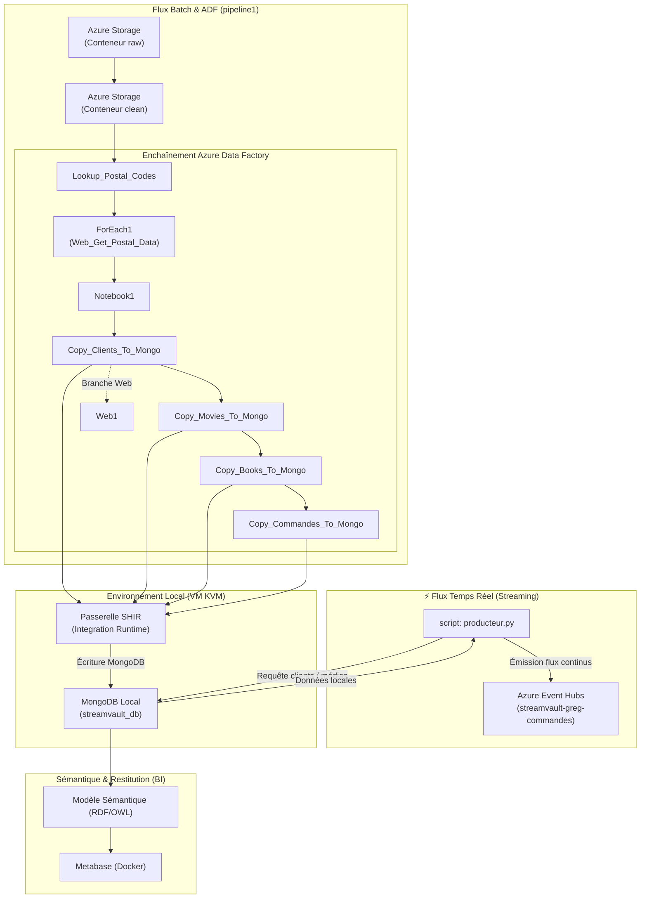

# StreamVault - Pipeline de Données Hybride (Temps Réel & Batch)

Bienvenue sur le dépôt du projet **StreamVault**. Ce projet met en œuvre une architecture de données moderne, combinant l'ingestion en temps réel (*streaming*) et le traitement par lots (*batch / ETL*) entre le Cloud Azure et un environnement local virtualisé.

---

##  Architecture Technique

Voici le schéma global représentant le parcours de la donnée de la collecte à la restitution analytique :

## Composants & Technologies

* **Ingestion Temps Réel :** Script Python (`producteur.py`) couplé à Azure Event Hubs pour simuler un trafic de commandes en continu.
* **Stockage & Staging Cloud :** Comptes Azure Storage segmentés en zones `raw` (brut) et `clean` (nettoyé).
* **Traitement & Orchestration :** Azure Databricks (notebooks de staging) et Azure Data Factory v2 pour orchestrer les pipelines de copie en cascade.
* **Hybridation & Base Locale :** Utilisation d'une passerelle SHIR (Self-Hosted Integration Runtime) hébergée sur une VM Windows locale couplée à MongoDB.
* **Modélisation & BI :** Structuration ontologique via RDF/OWL et restitution visuelle des KPI sous Metabase (conteneurisé via Docker).

##  Structure du Repository

* `assets/` : Dossier contenant les ressources graphiques et visuels du projet.
* `sources/` : Fichiers de données d'origine (`book1-100k.csv`, `clients.csv`, `movies.json`).
* `producteur.py` : Script Python assurant l'ingestion et la simulation du flux temps réel.
* `test_producteur.py` : Fichier de tests associé au producteur.
* `requirements.txt` : Liste des dépendances et packages Python du projet.
* `.env.exemple` : Modèle de configuration pour les variables d'environnement.
* `.gitignore` : Configuration des fichiers exclus du versioning Git.
* `README.md` : Documentation principale du dépôt.

